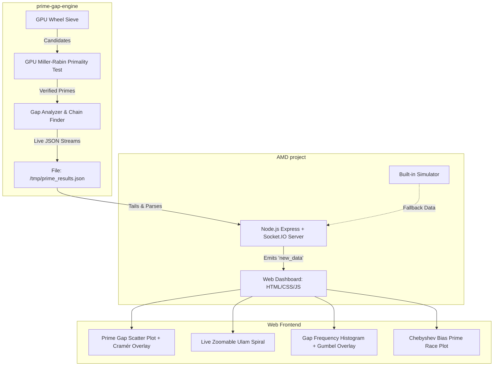

# AMD GPU-Accelerated Prime Discovery & Visualization Suite

A high-performance, real-time number theory exploration platform. This suite couples a GPU-accelerated C++/OpenCL/HIP computing engine with a modern web dashboard to discover, analyze, and visualize prime numbers, record-breaking prime gaps, Cunningham chains, and prime distribution statistics at scale.

---

## 📸 System Architecture

The project consists of two core components that communicate via an asynchronous live-streaming JSON buffer:



1. **`prime-gap-engine`**: A C++17 GPU-accelerated engine using OpenCL (Intel/AMD/NVIDIA) or HIP (AMD ROCm) to perform massive parallel number theory computations. It streams findings into a shared JSON log file.
2. **`AMD project`**: A Node.js + Socket.IO bridge server and a high-fidelity Single Page Application (SPA) dashboard. It visualizes the compute engine's output in real time using rich charts and animations.

---

## 📁 Project Structure

```text
├── AMD project/                  # Web dashboard and Node.js Socket.IO bridge server
│   ├── server.js                 # Socket.IO & Express bridge server (includes mock simulator)
│   ├── index.html                # Main responsive single-page web UI
│   ├── app.js                    # Plotly chart initialization, WS connection, UI updates
│   ├── styles.css                # Premium AMD-inspired dark-mode theme
│   ├── package.json              # Node.js dependencies & scripts
│   └── README.md                 # Dashboard-specific guidelines
│
├── prime-gap-engine/             # GPU-accelerated prime discovery C++ engine
│   ├── CMakeLists.txt            # CMake build system config
│   ├── kernels/                  # OpenCL GPU kernel source files (.cl)
│   ├── scripts/                  # Shell scripts for setup, running, and benchmarking
│   │   ├── install_deps.sh       # Dependency installation script (Ubuntu/Debian)
│   │   ├── run_engine.sh         # Launch helper script
│   │   └── benchmark.sh          # Profiling and performance scaling script
│   ├── src/                      # C++ source code files
│   │   ├── main.cpp              # Application entry point & compute loop
│   │   ├── sieve/                # GPU wheel-sieve implementation
│   │   ├── primality/            # Batch Miller-Rabin GPU kernel & Host
│   │   ├── chains/               # Cunningham chain detection (Type 1 & 2)
│   │   ├── gap/                  # Gap detection & record analyzer
│   │   ├── memory/               # Dynamic VRAM allocator & manager
│   │   ├── streaming/            # Appending results to live JSON stream
│   │   └── utils/                # Big integer arithmetic & OpenCL helpers
│   └── tests/                    # C++ verification test suite
│
├── requirements.txt              # Root-level Python requirements (plotting & benchmarks)
└── README.md                     # Master workspace documentation (this file)
```

---

## ⚡ Prerequisites

To run the complete suite, verify that your machine has the following software installed:

### 1. Compute Engine Requirements (C++)
* **CMake** (v3.16 or newer)
* **C++17 Compiler** (GCC 9+, Clang 10+, or MSVC 2019+)
* **OpenCL SDK / Runtime**:
  * **AMD**: ROCm (HIP/OpenCL runtimes)
  * **NVIDIA**: CUDA Toolkit (includes OpenCL headers/libraries)
  * **Intel**: Intel OneAPI SDK or Intel CPU/GPU OpenCL runtime
* **Threads library**: POSIX threads (`pthread`)

### 2. Dashboard Requirements (Web)
* **Node.js** (v18.x or newer recommended)
* **npm** (comes packaged with Node.js)
* **Modern Web Browser** (Chrome, Edge, Firefox, or Safari)

### 3. Scripting & Benchmarks (Python - Optional)
* **Python** (v3.8+) - required only for generating benchmark scale graphs and running simulation scripts.

---

## 🚀 Getting Started

Follow these steps to build the engine and run the live visualization dashboard.

### Step 1: Install Dependencies

#### System & GPU Runtimes (Linux Ubuntu/Debian example)
Run the convenience script in the `prime-gap-engine` folder to install OpenCL headers and runtime libraries:
```bash
sudo chmod +x prime-gap-engine/scripts/install_deps.sh
./prime-gap-engine/scripts/install_deps.sh
```

#### Python Packages (for Plotting & Benchmarks)
Install Python dependencies listed in the root `requirements.txt`:
```bash
pip install -r requirements.txt
```

#### Node.js Dashboard Packages
Navigate to the `AMD project` directory and install NPM packages:
```bash
cd "AMD project"
npm install
cd ..
```

---

### Step 2: Build the C++ Compute Engine

Build the C++ target executable using CMake:

#### On Linux / macOS
```bash
cd prime-gap-engine
mkdir -p build && cd build
cmake -DCMAKE_BUILD_TYPE=Release ..
make -j$(nproc)
cd ../..
```

#### On Windows (PowerShell)
```powershell
cd prime-gap-engine
mkdir build
cd build
cmake ..
cmake --build . --config Release
cd ../..
```
*Note: The compilation process automatically copies the OpenCL kernels directory into the target build folder.*

---

### Step 3: Run the Live Dashboard

Start the Socket.IO bridge server and dashboard server.

```bash
cd "AMD project"
npm run dev
```

This starts two concurrent services:
* **Backend Bridge Server**: Listening on [http://localhost:5000](http://localhost:5000)
* **Frontend Web Dashboard**: Served at [http://localhost:3000](http://localhost:3000) (will automatically launch in your browser)

> [!TIP]
> **Simulator Mode**: If the C++ engine has not started (meaning no `/tmp/prime_results.json` exists), the Node.js bridge server will automatically run a **live simulator** that generates mathematical mock data. This allows you to test the dashboard, charts, audio cues, and layout without needing a GPU environment or building the C++ binary!

---

### Step 4: Run the GPU Compute Engine

To start streaming real GPU computations to the dashboard, run the compiled C++ executable:

#### On Linux
```bash
./prime-gap-engine/build/prime_engine
```

#### On Windows
```powershell
.\prime-gap-engine\build\Release\prime_engine.exe
```

As soon as the C++ binary starts, it will overwrite or append to `/tmp/prime_results.json` (or `C:\Users\<User>\AppData\Local\Temp\prime_results.json` on Windows). The Node.js bridge server will detect the file, shut off the mock simulator, and start broadcasting the GPU-generated numbers directly to the dashboard charts!

---

## 📊 Benchmarking & Profiling

You can run automated scalability benchmarks on ROCm/OpenCL devices using the provided test scripts:

```bash
cd prime-gap-engine/scripts
chmod +x benchmark.sh
./benchmark.sh --start 1000000000000 --batch 10000000 --iterations 3
```

This script:
1. Sequentially doubles the GPU batch workload to test hardware scalability.
2. Extracts memory consumption via `rocm-smi` (if available).
3. Compiles iteration speed stats (Primes/sec) into `benchmark_results.csv`.
4. Uses Python to generate a scaling curve plot saved as `benchmark_plot.png`.

---

## 🧮 Mathematical & Scientific Features

The dashboard visualizes complex mathematical distributions:
* **Cramér Conjecture Overlay**: Shows prime gap trends $G_n$ vs the Cramér estimate $\ln^2(p)$.
* **Gumbel Overlay**: Fits gap distribution frequency histograms to the Gumbel extreme value distribution.
* **Chebyshev Bias**: Visualizes the "Prime Race" comparing primes $p \equiv 1 \pmod 4$ versus $p \equiv 3 \pmod 4$, illustrating the subtle bias towards $3 \pmod 4$ primes.
* **Cunningham Chains**: Tracks chains of primes where $p_{i+1} = 2p_i + 1$ (Type 1) or $p_{i+1} = 2p_i - 1$ (Type 2).
